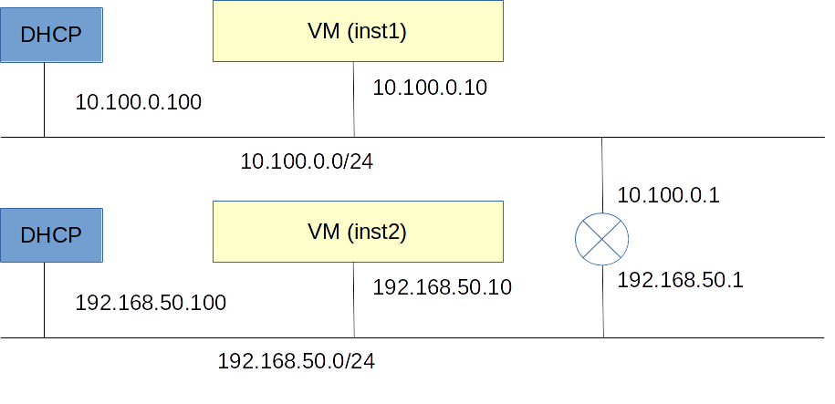

# Two virtual networks with router

## Overview

This document builds on the last guides. If you haven't already, make sure to complete the previous guides first: [Installation guide](../installation), [Single Network](single-network), [Single Network with DHCP server](single-network-dhcp) and [Two Networks](two-networks).

Now that we have two virtual networks with an interface in each, it makes sense to add a router to them so that both interfaces can reach each other. That's exactly what we'll do in this guide, resulting in the following topology.



## Setup

### Create the simulated interfaces

Just like OpenVNet's DHCP service, routers are simulated entirely in Open vSwitch's [flows](../jargon-dictionary#flow). Therefore we are again going to create simulated interfaces. The only difference from DHCP is that this time we are going to set the `enable_routing` flag.

First we'll add a simulated interface to the network `nw-test1` (the one `inst1` is in) with IP address `10.100.0.1`.

```bash
vnctl interfaces add \
  --uuid if-router1 \
  --network_uuid nw-test1 \
  --mac_address "02:00:00:00:02:01" \
  --ipv4_address 10.100.0.1 \
  --mode simulated \
  --enable_routing true
```

Next we'll add a similar simulated interface to the network `nw-test2` (the one `inst2` is in) with IP address `192.168.50.1`.

```bash
vnctl interfaces add \
  --uuid if-router2 \
  --network_uuid nw-test2 \
  --mac_address "02:00:00:00:02:02" \
  --ipv4_address 192.168.50.1 \
  --mode simulated \
  --enable_routing true
```

Now we have two new simulated interfaces that are capable of routing but we have not yet told OpenVNet that they should be able to route to each other. For that first we'll create a `route_link`

You can thing of a `route_link` as a central point that routed traffic passes through.

```bash
vnctl route_links add --uuid rl-1 --mac-address 02:00:10:00:00:01
```

Now we are add the actual routes.

These commands bring everything together. They tell OpenVNet to use the `route_link` and the simulated interfaces we just created to set up a router that can connect the networks `nw-test1` and `nw-test2`.

```bash
vnctl routes add \
  --uuid r-1 \
  --interface-uuid if-router1 \
  --network-uuid nw-test1 \
  --ipv4-network 10.100.0.0 \
  --route-link-uuid rl-1

vnctl routes add \
  --uuid r-2 \
  --interface-uuid if-router2 \
  --network-uuid nw-test2 \
  --ipv4-network 192.168.50.0 \
  --route-link-uuid rl-1
```

## Test

Routing is now set up and should be working. We could set up the routing table in our LXC guests manually but we don't need to. All we need to do is have them perform a new DHCP request. OpenVNet will automatically include these routes in its DHCP reply.

Log into `inst1` and have it do a DHCP request.

```bash
lxc-console -n inst1
service network restart
```

If everything went well, it should now have a new entry in its routing table. Try running `ip route show`. IT should include the following line in its output.

```bash
192.168.50.0/24 via 10.100.0.1 dev eth0  proto static
```

Now have `inst2` do a new DHCP request as well.

```bash
lxc-console -n inst2
service network restart
```

Now try to have `inst2` ping `inst1` again. Now that there is a router connecting both networks, ping should be working. If it's not working, something went wrong. Review the commands and check if you made a mistake anywhere.

## Remark

Have another look at VNA's log file.

```bash
tail /var/log/openvnet/vna.log
```

If you haven't done anything special after the two LXC guests pinged each other, you'll see these lines.

```bash
I, [2015-12-17T17:28:15.168336 #1538]  INFO -- : 0x0000aaaaaaaaaaaa interface/simulated: simulated arp reply (arp_tpa:192.168.50.1)
I, [2015-12-17T17:28:15.182135 #1538]  INFO -- : 0x0000aaaaaaaaaaaa interface/simulated: simulated arp reply (arp_tpa:10.100.0.1)
```

That's OpenVNet's simulated interfaces in action. To the LXC guests, it looks like they're communicating with regular routers. They discover their MAC Address through ARP and then send IP packets. In reality though, these interfaces don't exist and everything is simulated using OpenFlow.

## What's next

You're done. You have completed all examples contained in this OpenVNet tutorial. There's a couple of things you can from here.

* Have a look at the actual flows in Open vSwitch using the [vnflows-monitor](../debugging/vnflows-monitor) debug tool.

* Check out the [integration test](../debugging/integration-test) for an example of more complicated OpenVNet environments.

* Maybe try adding some more LXC guests and setting up your own virtual network environments.

* How about trying to create an environment with multiple hosts, each with their own Open vSwitch and VNA. This will require some more setup and is currently not yet covered in this documentation. It will require you to carefully study the examples in the [integration test](../debugging/integration-test).

Thank you for taking the time to check out OpenVNet. Good luck, have fun and be creative.

If you need any further help, don't hesitate to contact us on the [Wakame Users Group](https://groups.google.com/forum/#!forum/wakame-ug). We're very busy and might not get back to you immediately but we'll do our very best to help you out.
